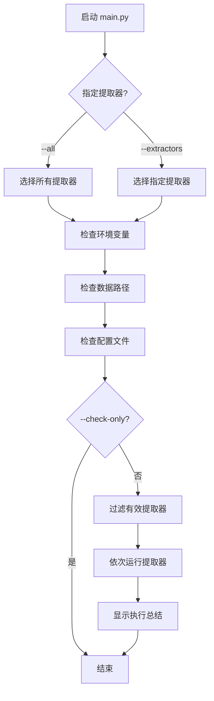

# 实体提取工具使用指南

## 快速开始

### 使用 main.py 统一入口（推荐）

```powershell
# 进入实验目录
cd E:\entities\experiments\exp01_baseline

# 运行所有提取器
python src\extraction\main.py --all

# 运行指定提取器
python src\extraction\main.py --extractors deepseek gemini

# 仅检查环境配置
python src\extraction\main.py --all --check-only

# 查看完整帮助
python src\extraction\main.py --help
```

### 直接运行单个脚本

```powershell
# 运行 DeepSeek
python src\extraction\exact_deepseek.py

# 运行 Gemini
python src\extraction\exact_gemini.py

# 运行 Kimi
python src\extraction\exact_kimi.py
```

## main.py 功能特性

### ✨ 主要功能

1. **环境检查**
   - 自动检测 API Key 配置
   - 验证数据路径和论文文件
   - 检查配置文件完整性

2. **灵活运行**
   - 支持运行单个或多个提取器
   - 支持按序串行执行
   - 实时显示执行进度和日志

3. **错误处理**
   - 统一的异常捕获
   - 详细的错误信息
   - 支持 Ctrl+C 中断

4. **执行总结**
   - 显示每个提取器的执行结果
   - 提供输出目录位置
   - 统计执行时间

### 📋 命令行参数

| 参数 | 简写 | 说明 |
|------|------|------|
| `--all` | `-a` | 运行所有提取器 |
| `--extractors` | `-e` | 指定要运行的提取器（deepseek/gemini/kimi） |
| `--check-only` | `-c` | 仅检查环境，不运行提取 |
| `--dry-run` | `-d` | 模拟运行，不实际执行 |
| `--skip-data-check` | | 跳过数据路径检查 |
| `--help` | `-h` | 显示帮助信息 |

### 💡 使用示例

#### 1. 首次使用 - 检查环境

```powershell
# 检查所有提取器的环境配置
python src\extraction\main.py --all --check-only
```

输出示例：
```
======================================================================
                    实体提取工具 v1.0
======================================================================
运行时间: 2025-10-17 10:30:00
工作目录: E:\entities\experiments\exp01_baseline
======================================================================

📋 选择的提取器: DeepSeek, Gemini, Kimi

🔍 检查环境配置...
----------------------------------------------------------------------
✓ DeepSeek: 已配置 DEEPSEEK_API_KEY
✓ Gemini: 已配置 HIAPI_API_KEY
  可选配置: EXTRACT_SLEEP_SECS
❌ Kimi: 缺少必需的环境变量
   请设置以下任一变量: KIMI_API_KEY, MOONSHOT_API_KEY

🔍 检查数据路径...
----------------------------------------------------------------------
📊 论文统计:
   - 优先论文: 15 篇
   - 普通论文: 35 篇
   - 合计: 50 篇

🔍 检查配置文件...
----------------------------------------------------------------------
✓ Prompt 文件: E:\entities\experiments\exp01_baseline\config\prompts\extraction_prompt.txt

✓ 环境检查完成
```

#### 2. 运行单个提取器

```powershell
# 仅运行 DeepSeek
python src\extraction\main.py -e deepseek
```

#### 3. 运行多个提取器

```powershell
# 运行 DeepSeek 和 Gemini
python src\extraction\main.py -e deepseek gemini
```

#### 4. 运行所有可用提取器

```powershell
# 运行所有（会自动跳过未配置的）
python src\extraction\main.py --all
```

#### 5. 模拟运行（测试）

```powershell
# 检查但不实际执行
python src\extraction\main.py --all --dry-run
```

## 环境变量配置

### 必需的环境变量

```powershell
# DeepSeek
$env:DEEPSEEK_API_KEY = "sk-xxxxxxxxxxxxxxxx"

# Gemini (二选一)
$env:HIAPI_API_KEY = "sk-xxxxxxxxxxxxxxxx"
$env:GEMINI_API_KEY = "sk-xxxxxxxxxxxxxxxx"

# Kimi (二选一)
$env:KIMI_API_KEY = "sk-xxxxxxxxxxxxxxxx"
$env:MOONSHOT_API_KEY = "sk-xxxxxxxxxxxxxxxx"
```

### 可选的环境变量

```powershell
# 通用配置
$env:IN_SCOPE_LIMIT = "50"              # 优先论文数量限制
$env:AUTO_CONTINUE_REST = "y"           # 自动继续处理普通论文

# DeepSeek 特定
$env:DEEPSEEK_MAX_TOKENS_BASE = "2048"  # 基础 token 限制
$env:DEEPSEEK_MAX_TOKENS_CAP = "8192"   # 最大 token 限制
$env:DEEPSEEK_TEMPERATURE = "0"         # 采样温度

# Gemini 特定
$env:HIAPI_BASE_URL = "https://hiapi.online/v1"
$env:EXTRACT_SLEEP_SECS = "1"           # 请求间隔秒数
$env:EXTRACT_MAX_RETRIES = "3"          # 最大重试次数
$env:EXTRACT_SKIP_PREFLIGHT = "0"       # 跳过预检
```

### 持久化环境变量（推荐）

创建 `.env` 文件或使用系统环境变量：

```powershell
# 设置用户级环境变量（永久）
[System.Environment]::SetEnvironmentVariable("DEEPSEEK_API_KEY", "sk-xxx", "User")

# 或创建 .env 文件（需要配合 python-dotenv）
# 在项目根目录创建 .env
DEEPSEEK_API_KEY=sk-xxxxxxxxxxxxxxxx
HIAPI_API_KEY=sk-xxxxxxxxxxxxxxxx
```

## 输出结构

```
outputs/
└── extractions/
    ├── deepseek/
    │   ├── priority/          # 优先论文提取结果
    │   │   ├── paper1.json
    │   │   └── paper2.json
    │   ├── general/           # 普通论文提取结果
    │   │   └── paper3.json
    │   └── logs/              # 日志文件
    │       ├── extraction_log.ndjson
    │       └── timings.ndjson
    ├── gemini/
    │   └── ...
    └── kimi/
        └── ...
```

## 执行流程



## 常见问题

### Q1: 提示环境变量未配置？

**A:** 确保在当前 PowerShell 会话中设置了环境变量：
```powershell
$env:DEEPSEEK_API_KEY = "your-key-here"
```

### Q2: 找不到论文文件？

**A:** 检查论文是否放在正确的目录：
- 优先论文: `data/raw/papers/priority/*.md`
- 普通论文: `data/raw/papers/general/*.md`

### Q3: Prompt 文件不存在？

**A:** 确保存在配置文件：
```
config/prompts/extraction_prompt.txt
```

### Q4: 如何中断执行？

**A:** 按 `Ctrl+C` 可以随时中断正在运行的提取器。

### Q5: 如何查看详细日志？

**A:** 日志保存在：
```
outputs/extractions/{provider}/logs/extraction_log.ndjson
```

### Q6: 多个提取器会并行运行吗？

**A:** 不会，当前设计是串行执行，避免 API 限流和资源冲突。

## 与直接运行脚本的对比

| 特性 | main.py | 直接运行脚本 |
|------|---------|-------------|
| 环境检查 | ✅ 自动 | ❌ 手动 |
| 批量运行 | ✅ 支持 | ❌ 需逐个运行 |
| 进度显示 | ✅ 统一 | ⚠️ 各自独立 |
| 错误处理 | ✅ 统一 | ⚠️ 各自处理 |
| 执行总结 | ✅ 有 | ❌ 无 |
| 灵活性 | ✅ 高 | ⚠️ 中等 |

## 最佳实践

1. **首次使用**：先运行 `--check-only` 确保环境正确
2. **小规模测试**：先处理少量论文验证配置
3. **使用 --dry-run**：在大规模运行前模拟测试
4. **定期检查日志**：监控提取质量和错误
5. **设置 AUTO_CONTINUE_REST=n**：手动控制是否继续处理普通论文

## 下一步

- [ ] 考虑添加并行执行支持
- [ ] 添加结果验证和质量检查
- [ ] 支持从配置文件读取参数
- [ ] 添加断点续跑支持
- [ ] 集成 .env 文件支持
